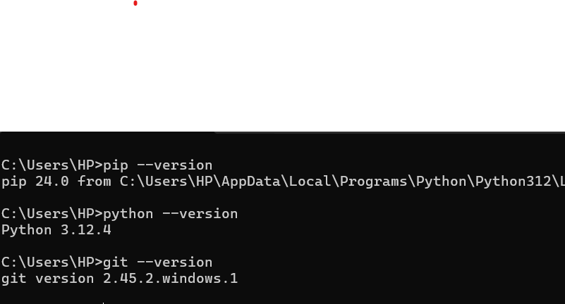

# Dev_Setup
Setup Development Environment

#Assignment: Setting Up Your Developer Environment

#Objective:
This assignment aims to familiarize you with the tools and configurations necessary to set up an efficient developer environment for software engineering projects. Completing this assignment will give you the skills required to set up a robust and productive workspace conducive to coding, debugging, version control, and collaboration.

#Tasks:

1. Select Your Operating System (OS):
   Choose an operating system that best suits your preferences and project requirements. Download and Install Windows 11. https://www.microsoft.com/software-download/windows11

   Windows Operating System
   First check for compatibility by downloading and running the PC health check to ensure Pc meets all the hardware requirements to update.
   Back up Pc just in case something goes wrong.
   Open update and Security settings.
   Click Download and install on the windows 11 menu.
   Follow through with the download process,accept license agreement then downloading will start then verifying download and lastly installing.
   Restart PC and let the PC run the installation process.
   Complete,once installation is over log in as normal.
   One can upgrade via windows website.

2. Install a Text Editor or Integrated Development Environment (IDE):
   Select and install a text editor or IDE suitable for your programming languages and workflow. Download and Install Visual Studio Code. https://code.visualstudio.com/Download

   Visit the visual studio website and click on download visual studio.
   Follow the instructions on the screen to download installer.
   Choose Visual workload during installation.
   Select workloads and components you need based on development requirements.
   Install then launch visual studio code .
   Sign in with your microsoft account or create one.
   Select your development environment.

3. Set Up Version Control System:
   Install Git and configure it on your local machine. Create a GitHub account for hosting your repositories. Initialize a Git repository for your project and make your first commit. https://github.com

   Visit the official git website.
   Download the installer,run the downloaded installer(.exe file)
   Follow the prompts in the installer.
   Verify installation by opening command prompt and type git --version then press enter then you should see the version of git installed.
   Configure Git by opening a terminal or command prompt then type the commands Your Name and Your.email@example.com with your name and email adress.
   To create a GitHub account open a web browser and serach github.com.
   Sign-up by filling your information i.e username,email address and password.
   To initialize a Git repository,open a terminal and use cd commandto navigate to your project then initialize by git init command.
   Commit by git add . command to add specific files then git commit -m "message" one can replace message with any text.
   After committing, one can push to github by git push command.

4. Install Necessary Programming Languages and Runtimes:
  Instal Python from http://wwww.python.org programming language required for your project and install their respective compilers, interpreters, or runtimes. Ensure you have the necessary tools to build and execute your code.

  Download python by visiting python.org website and choose the latest version suitable for your PC.
  Run the installer then double click on it.
  Tick the box that says add python to path and install.
  Verify installation by opening command prompt and type python --version.
  One can then go to visual studio code and install the intepreters on the extension icon.
  The necessary tools arepython interpeter,an IDE e.g Visual studio code,package manager e.g pip,version control system e.g Git, Virtual environments, Dedugger.

5. Install Package Managers:
   If applicable, install package managers like pip (Python).

   To install pip, first install python and add to path.
   Open command prompt and install pip by typing python -m pip install.
   Then check version by pip --version.

6. Configure a Database (MySQL):
   Download and install MySQL database. https://dev.mysql.com/downloads/windows/installer/5.7.html

Download MySQL by visiting oficial MySQL website and select appropriate installer based on windows version.
After downloading open in folder and double click on it to run.
Choose Developer default setup(Development machine)
Set a root password.
Click on next and accept any license agreement.
Complete installation and execute.
Finish.
Open command prompt and type mysql -u root -p and enter your root password and it will be connected to MySQL shell.
Go to MySQL Workbench and it should open automatically.

7. Set Up Development Environments and Virtualization (Optional):
   Consider using virtualization tools like Docker or virtual machines to isolate project dependencies and ensure consistent environments across different machines.

   Download and install Docker desktop for windows from Docker Hub.
   After installation start docker desktop application.
   Docker will run containers directly on your system 
   Create a Dockerfile.
   Use docker-compose for multi-container applications
   Map ports between local machine ang containers using Dockerfile EXPOSE command.
   Start developing and test and ensure it works correctly.
   Backup regularly.

8. Explore Extensions and Plugins:
   Explore available extensions, plugins, and add-ons for your chosen text editor or IDE to enhance functionality, such as syntax highlighting, linting, code formatting, and version control integration.

   Go to visual studio code click on files then preferences then extensions.
   There are many different extensions for different programming languages.
   Look at the different extensions and install some that wiil be useful e.g Python by microsoft,JavaScript(ES6)code snippets,java extension pack by microsoft,HTML/CSS support,PHP Intellisense and others.

9. Document Your Setup:
    Create a comprehensive document outlining the steps you've taken to set up your developer environment. Include any configurations, customizations, or troubleshooting steps encountered during the process. 

    Having the preffered OS for my case is the windows operating system and installation of windows 11 on my PC.
    Downloading and installation of an IDE which is the Visual studio code.
    Setting up Version Control system which is Git by downloading and configuring it.
    Installing python and its compilers and intepreters.Installation of dart and also flutter.
    Installation of package managers which is pip and verification of the installation.
    Downloading and installation Of MySQL database and its configuration.
    Installation of different extensions from Visual studio code necessary for coding.
    The setup has been quite smooth with a few challenges like;
    Ensuring that development tools are compatible withmy OS but it has not been a major problem since there are specifications before installation
    Configuring IDE and version control can be quite challenging but with different documentations and searching on the internet it becomes manageable.
    Setting up a development environment requires different resorces and can take up a lot of time.
    Ensuring the development environment is secure by updating software versions to mitigate security risks.

#Deliverables:
- Document detailing the setup process with step-by-step instructions and screenshots where necessary.
- A GitHub repository containing a sample project initialized with Git and any necessary configuration files (e.g., .gitignore).
- A reflection on the challenges faced during setup and strategies employed to overcome them.

#Submission:
Submit your document and GitHub repository link through the designated platform or email to the instructor by the specified deadline.

#Evaluation Criteria:**
- Completeness and accuracy of setup documentation.
- Effectiveness of version control implementation.
- Appropriateness of tools selected for the project requirements.
- Clarity of reflection on challenges and solutions encountered.
- Adherence to submission guidelines and deadlines.

Note: Feel free to reach out for clarification or assistance with any aspect of the assignment.
